# Escape from Tarkov Storyline Map Data

## Mermaid Flowchart

```mermaid
graph TD
  %% Goal: match image flow. No ending convergence. Keep each ending as its own vertical stack.

  %% ---------- Styles ----------
  classDef dark fill:#0C0C0C,stroke:#222,color:#fff;
  classDef box fill:#0C0C0C,stroke:#666,color:#fff;
  classDef ponr fill:#0C0C0C,stroke:#ff5a5a,color:#fff;
  classDef timegate fill:#0C0C0C,stroke:#d946ef,color:#fff;
  classDef achieve fill:#0C0C0C,stroke:#4ade80,color:#fff;
  classDef ending fill:#0C0C0C,stroke:#fbbf24,color:#fff;
  classDef warn fill:#0C0C0C,stroke:#a78bfa,color:#fff;

  %% ---------- Title ----------
  Title["Version 1.3.1<br/>last edited: 14.12.2025 9:00pm (UTC+1)"]:::dark

  %% =========================================================
  %% TOP: Armored Case
  %% =========================================================
  Recover["Recover Armored Case from Wrecked Crashed Plane"]:::box
  KeepSelf["Keep Case for yourself"]:::ponr
  GivePrapor0["Hand over Case to Prapor"]:::ponr

  PraporComp["Find compromising material on Prapor on Lighthouse"]:::box
  LKAccess["Gain Lightkeeper Access<br/>(Network Provider 1 is available)"]:::box
  TalkLK0["Talk to Lightkeeper<br/>(Day 3?)<br/>(Terragroup Blue Folder)"]:::box
  YellowFlare["Fire Yellow Flare in front of Ultra Mall<br/>(Interchange)"]:::box
  Kill15["Kill 15 Targets without dying<br/>(one Raid)"]:::box
  LKCase["Collect Case from Lightkeeper<br/>(goes into Special Slot)"]:::box

  ArmoredHands["Armored Case in your Hands"]:::box
  OpenCase["Open the Case<br/>(find Signal Jammer on Labs)"]:::box
  TG48["48h Craft at Workbench"]:::timegate
  CaseOpen["Case is open"]:::box

  Title --> Recover
  Recover --> KeepSelf --> ArmoredHands
  Recover --> GivePrapor0 --> PraporComp --> LKAccess --> TalkLK0 --> YellowFlare --> Kill15 --> LKCase --> ArmoredHands
  ArmoredHands --> OpenCase --> TG48 --> CaseOpen

  %% =========================================================
  %% SPLIT: Work with Kerman
  %% =========================================================
  DontWork["dont work with<br/>Kerman"]:::ponr
  WorkTogether["work together with<br/>Kerman"]:::ponr
  CaseOpen --> DontWork
  CaseOpen --> WorkTogether

  %% =========================================================
  %% SURVIVOR (dont work with Kerman) - FIXED LAYOUT
  %% =========================================================
  SL_Shore["Head to Shoreline<br/>Port Entrance<br/>(Intercom) swipe Keycard"]:::box
  SL_KeyFail["Keycard didnt work,<br/>ask Prapor for help"]:::box

  %% Cost decision (parallel, not sequential)
  SL_300["Prapor wants 300 Million Roubles<br/>since you gave him the Case"]:::box
  SL_500["Prapor wants 500 Million Roubles<br/>since you kept the Case"]:::box

  %% Main linear task chain (orange bracket in image)
  SL_TG["Find 4 Terragroup report folders<br/>on Labs"]:::box
  SL_5["5h Craft at Intel Centre"]:::timegate
  SL_Flash["Give Prapor the Flash Drive<br/>with Data"]:::box
  SL_Kill50["Kill 50 targets on<br/>Streets of Tarkov"]:::box
  SL_Kill4["Kill 4 PMCs<br/>(single raid and survive)"]:::box
  SL_48["48h Timegate"]:::timegate
  SL_Note["Prapor hands you a Note<br/>for the Soldiers at the Terminal"]:::box
  SL_Easy["Easy Way<br/>Achievement"]:::achieve

  %% Flow
  DontWork --> SL_Shore --> SL_KeyFail

  SL_KeyFail --> SL_300
  SL_KeyFail --> SL_500

  %% Both costs converge into same task chain
  SL_300 --> SL_Note
  SL_500 --> SL_TG

  %% Linear progression
  SL_TG --> SL_5 --> SL_Flash --> SL_Kill50 --> SL_Kill4 --> SL_48 --> SL_Note --> SL_Easy

  EndSetup_Survivor["Head to Shoreline (22:00 to 04:00)<br/>Intercom at Tower, swipe Keycard<br/>Approach Terminal (no weapon in hand)<br/>Start escape attempt"]:::ending
  FailSurvivor["If attempt fails:<br/>buy a new Note for 5M roubles at Prapor<br/>(2 per reset)"]:::ending
  Survivor(("Survivor Ending")):::ending
  
  SL_Easy --> EndSetup_Survivor --> FailSurvivor --> Survivor


  %% =========================================================
  %% WORK TOGETHER: Labs -> Mechanic -> RFID -> Shoreline
  %% =========================================================
  WT_Search["Search for Masterkeycard and RFID Device<br/>on Labs"]:::box
  WT_Keycard["Keycard acquired, device not:<br/>talk to Mechanic"]:::box
  TG24["24h timegate"]:::timegate
  WT_PayMech["Pay Mechanic 40 Bitcoins"]:::box
  WT_Elekt["Go with Mechanic's keys to Elektronik apartment<br/>and get RFID Device"]:::box
  WT_Activate["Activate RFID Card from Armored Case"]:::box
  TG50["50h Craft at Intel Centre"]:::timegate
  WT_Shore["Head to Shoreline<br/>Port Entrance (Intercom) swipe Keycard"]:::box

  WorkTogether --> WT_Search --> WT_Keycard --> TG24 --> WT_PayMech --> WT_Elekt --> WT_Activate --> TG50 --> WT_Shore

  %% =========================================================
  %% POST-SWIPE: 3 branches (Savior / Fallen / Debtor)
  %% =========================================================
  HK_Savior["Help Kerman find Evidence<br/>on Terragroup"]:::ponr
  NK_Fallen["Do not help Kerman find Evidence<br/>on Terragroup"]:::ponr
  HK_Debtor["Help Kerman find Evidence<br/>on Terragroup"]:::ponr

  WT_Shore --> HK_Savior
  WT_Shore --> NK_Fallen
  WT_Shore --> HK_Debtor

  %% =========================================================
  %% SAVIOR
  %% =========================================================
  AudioNote["Listen to every audiotape and read every note<br/>for all storys"]:::box
  CompleteAll["Complete every other story chapter<br/>and hand evidence in"]:::box
  TG48b["48h timegate"]:::timegate
  Trusted["Kerman's trusted contact reaches out (Fence)"]:::box
  Fence4["Get 4.0 Fence reputation"]:::box
  Kill5NoScav["Kill 5 PMCs in a raid without killing scavs<br/>(Shoreline and Interchange)"]:::box
  Coop["Use Co-Op extract with a scav<br/>(Woods and Reserve)"]:::box
  BTR04["Raise BTR driver reputation to 0.4<br/>(complete The Price of Independence)"]:::box
  WarnBTR["Failing BTR rep (or missing Major Evidence)<br/>can force you onto Survivor path"]:::warn
  Solar_Savior["Build Solar Power (mandatory)"]:::box
  Build72_Savior["72h build time"]:::timegate
  FinalCraft_Savior["Final craft for the Keycard"]:::box

  HK_Savior --> AudioNote --> CompleteAll --> TG48b --> Trusted --> Fence4
  CompleteAll -.-> WarnBTR
  Fence4 --> PVP --> Kill5NoScav --> BTR04
  Fence4 --> PVE -->  Coop --> BTR04
  BTR04 -.-> WarnBTR -.-> SL_Shore
  BTR04 --> Solar_Savior --> Build72_Savior --> FinalCraft_Savior

  EndSetup_Savior["Head to Shoreline (22:00 to 04:00)<br/>Intercom at Tower, swipe Keycard<br/>Approach Terminal (no weapon in hand)<br/>Start escape attempt"]:::ending
  FailSavior["If attempt fails:<br/>craft the Keycard again (11h)<br/>needs a new Blank RFID Card"]:::ending
  Savior(("Savior Ending")):::ending

  FinalCraft_Savior --> EndSetup_Savior --> FailSavior --> Savior

  %% =========================================================
  %% FALLEN
  %% =========================================================
  Enough["Enough of your Games!<br/>Achievement"]:::achieve
  TalkPrapor["Talk to Prapor"]:::box

  NK_Fallen --> Enough --> TalkPrapor

  CaseBack["If you handed the case to Prapor earlier<br/>and got it back from Lightkeeper"]:::box
  NoCaseBack["If you did not hand the case to Prapor earlier"]:::box

  Repair40["Hand over 40 Repair Kits<br/>(100% durability, non-FIR)"]:::box
  SecureCont["Hand over Gamma/Theta/Epsilon Secure Container"]:::box
  Military50["Hand over 50 Military Components<br/>(Virtex/COFDM/etc, non-FIR)"]:::box

  BioCase["Get the Bio Weapon Case (Reserve RB-PKPM?)<br/>Hand it over to Prapor"]:::box
  USD1m["Hand over 1M USD"]:::box
  WillBlow["Will it Blow?<br/>Achievement"]:::achieve
  TG48c["48h timegate"]:::timegate
  HashUSB["Prapor gives you a USB stick with his Hash Code"]:::box

  Solar_Fallen["Build Solar Power (mandatory)"]:::box
  Build72_Fallen["72h build time"]:::timegate
  FinalCraft_Fallen["Final craft for the Keycard"]:::box

  TalkPrapor --> CaseBack --> BioCase
  TalkPrapor --> NoCaseBack --> Repair40 --> SecureCont --> Military50 --> BioCase
  BioCase --> USD1m --> WillBlow --> TG48c --> HashUSB --> Solar_Fallen --> Build72_Fallen --> FinalCraft_Fallen

  EndSetup_Fallen["Head to Shoreline (22:00 to 04:00)<br/>Intercom at Tower, swipe Keycard<br/>Approach Terminal (no weapon in hand)<br/>Start escape attempt"]:::ending
  FailFallen["If attempt fails:<br/>craft the Keycard again (11h)<br/>needs a new Blank RFID Card"]:::ending
  Fallen(("Fallen Ending")):::ending

  FinalCraft_Fallen --> EndSetup_Fallen --> FailFallen --> Fallen

  %% =========================================================
  %% DEBTOR
  %% =========================================================
  Hand2Major["Hand 2 Major Evidence in to Kerman,<br/>then stop working with him"]:::box
  UTurn["U Turn<br/>Achievement"]:::achieve
  TalkLK["Talk to Lightkeeper"]:::box

  HK_Debtor --> Hand2Major --> UTurn --> TalkLK

  Topo["Find topographic recommendations (5 total)<br/>5 maps, 1 per map"]:::box
  TG24b["6h Craft at Intel Centre"]:::timegate
  HashDrive["Bring a special flash drive with Hashmail<br/>to Lightkeeper"]:::box
  Kill30["Kill 30 PMCs on Woods<br/>and hand over 100 PMC dogtags"]:::box
  Amulet["Find Cultist Amulet in each Marked Room"]:::box
  Place["Place all amulets at Shared Bedroom Marked Key<br/>on Lightkeeper Island"]:::box
  TG48d["48h timegate"]:::timegate
  LKKey["Lightkeeper hands you a Keycard for Terminal"]:::box

  TalkLK --> Topo --> TG24b --> HashDrive --> Kill30 --> Amulet --> Place --> TG48d --> LKKey

  EndSetup_Debtor["Head to Shoreline (22:00 to 04:00)<br/>Intercom at Tower, swipe Keycard<br/>Approach Terminal (no weapon in hand)<br/>Start escape attempt"]:::ending
  FailDebtor["If attempt fails:<br/>barter a new keycard from Lightkeeper<br/>for 1 Blue Folder"]:::ending
  Debtor(("Debtor Ending")):::ending

  LKKey --> EndSetup_Debtor --> FailDebtor --> Debtor
```

## Storyline Paths Overview

### Starting Decisions

1. **Armored Case**: Recover from crashed plane
2. **Case Disposition**: Keep for yourself OR give to Prapor (longer route to get it back)
3. **Kerman Alliance**: Don't work with Kerman OR work together (splits into 3 paths)

### Four Ending Paths

#### **Survivor Path** (Green)

- Don't work with Kerman, go through Prapor
- Key decision: Pay 300M Roubles (if gave case to Prapor) OR 500M Roubles (if kept case)
- Notable steps: Terragroup reports → Labs data → Streets kills → PMC survival
- Ending: Quick escape through terminal with Prapor's help

#### **Savior Path** (Orange)  

- Work with Kerman, fully help find evidence on Terragroup
- Requirements: Complete all story chapters, 4.0 Fence rep, 0.4 BTR rep
- Choice: PVP (kill 5 PMCs no scavs) OR PVE (Co-Op extracts)
- Warning: Failing BTR rep can force you onto Survivor path
- Ending: Heroic escape with Kerman's trust

#### **Fallen Path** (Gray)

- Work with Kerman initially, then refuse to help find evidence
- Key decision: If you gave case to Prapor earlier → shorter path
- If you kept case → longer path requiring 40 repair kits, secure container, 50 military components
- Final requirement: 1M USD payment to Prapor
- Ending: Dark escape after ultimate betrayal

#### **Debtor Path** (Purple)

- Work with Kerman partially, then switch to Lightkeeper
- Key decision: Hand 2 Major Evidence to Kerman, then stop working with him
- Notable steps: Topographic maps → Cultist amulets → 100 PMC dogtags
- Ending: Escape through Lightkeeper's debt and favor

### Common Elements

- All paths require: Signal Jammer from Labs → 48h craft → Case open
- All endings: Shoreline terminal access (22:00-04:00) → Keycard swipe → Escape attempt
- Failure handling: Each ending has retry mechanics (new note, recraft, or barter)
